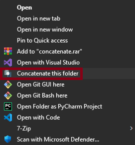
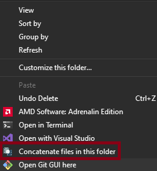
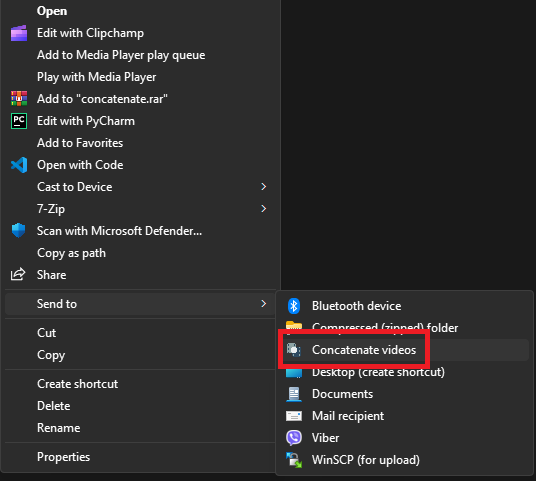

## Overview

The **Concatenate Videos Utility** is a command-line tool written in C that allows users to seamlessly concatenate multiple video files into a single output file using FFmpeg. This utility also integrates a custom context menu entry in Windows Explorer for easy access, making the video concatenation process straightforward and efficient.

## Features

- Concatenate multiple video files into one.
- Automatically generates a temporary file listing the input video files.
- Integrates with Windows context menu for quick access.

## Requirements

- **FFmpeg**: Ensure that FFmpeg is installed and accessible from the command line. You can download it from [FFmpeg's official website](https://ffmpeg.org/download.html).
- **Windows**: This utility includes a Windows registry script to create a context menu entry.

## Installing

To install the utility, simply run `setup.bat` in the command prompt. This script will create the necessary registry entries to add the "Concatenate Videos" option to the context menu.

## Usage

You can concatenate videos in several convenient ways:

1. **By Clicking on a Folder**

Navigate to the folder containing your video files. Right-click on the folder and select **Concatenate Videos** from the context menu. This option will concatenate all video files within the folder.

2. **By Clicking in the Background Inside a Folder**

Open the folder with your video files. Right-click in the background of the folder (not on any specific file) and select **Concatenate Videos**. This will concatenate all video files present in that folder.

3. **By Using the Send To Menu**

Select one or more video files you wish to concatenate. Right-click on the selected files, navigate to **Send to**, and choose **Concatenate Videos**. This method allows you to concatenate the selected videos easily.

## File naming format

The utility concatenates videos based on their file names, so it is essential to name your input video files in a specific format for correct ordering. For example, use the following naming convention:

- `1.mp4`
- `2.mp4`
- `3.mp4`

This naming scheme will ensure that the video files are concatenated in the correct sequence from `1` to `3`.

**Supported Formats**: The utility supports various video formats, including:

- MP4
- MOV
- MKV
- AVI
- FLV
- WMV
- WEBM

## Why use the Send to option or Folder Context Menu

Windows does not allow you to pass multiple files directly to a command-line program in a way that the program can handle correctly. If you try to select multiple video files and execute the program directly, Windows will launch separate instances of the program for each file, which is not the intended behavior. By using the **Send To** option or the context menu for a folder, you ensure that all selected files are processed in a single instance of the program.
